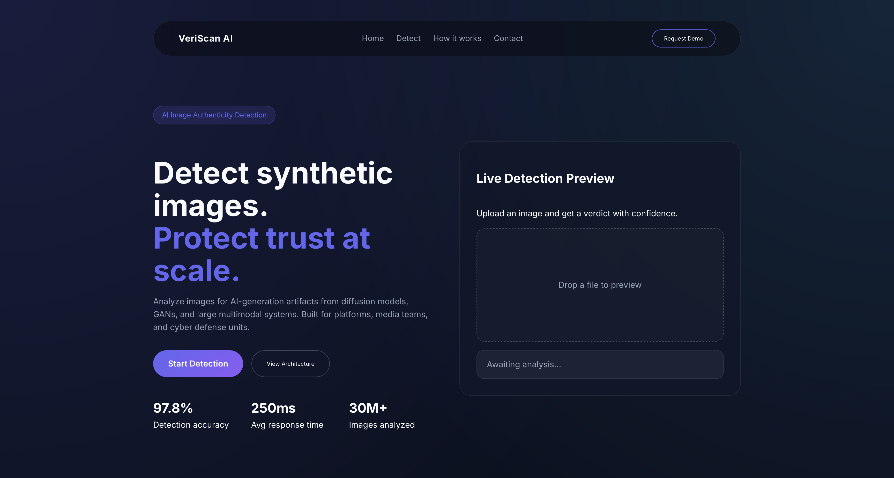
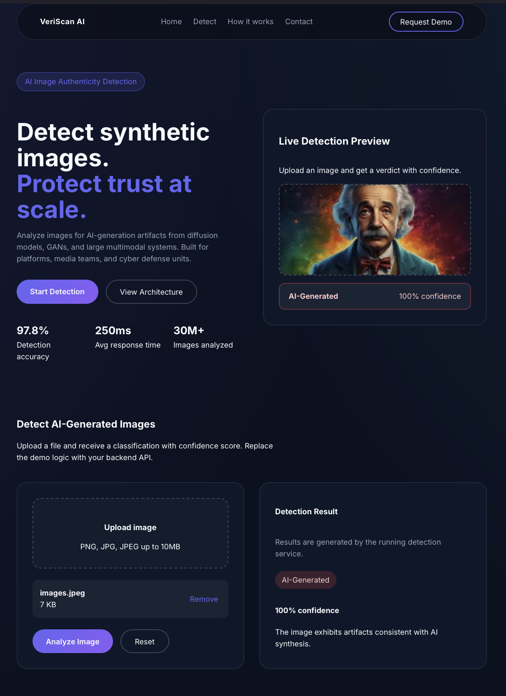

# Deep Fake Detector (AI Image Authenticity)

Detect whether an image is **AI‑generated** or **real** using a local Python model service and a React frontend. This project provides:
- A modern React UI for uploads and results
- A Node/Express backend that proxies requests
- A Python FastAPI service running the detection model locally

> Model reference and background reading:
> https://exnrt.com/blog/ai/fine-tuning-siglip2/#google_vignette

---

## ✨ Features
- Drag‑and‑drop image upload
- Confidence score and verdict
- Local inference (no external API required)
- Simple architecture suitable for demos or research

---

## 🖼️ Screenshots





---

## 🧱 Project Structure
```
Deep_Fake_Detector/
├── backend/
│   ├── server.js
│   ├── package.json
│   └── python_service/
│       ├── app.py
│       └── requirements.txt
└── frontend/
    ├── src/
    └── package.json
```

---

## ⚙️ Architecture (Theory)
1. **Frontend (React)**
   - User uploads an image.
   - UI sends a `POST` request to the backend.

2. **Backend (Node/Express)**
   - Receives the image via `/api/detect`.
   - Forwards it to the Python service.

3. **Python Service (FastAPI + Transformers)**
   - Loads the model locally.
   - Runs inference on the image.
   - Returns a verdict + confidence score.

---

## ✅ Prerequisites
- Node.js 18+
- Python 3.10 or 3.11 recommended
- Git

---

## 🚀 Setup & Run (Step‑by‑Step)

### 1) Python Service (Model API)
```
cd backend/python_service
python3 -m venv .venv
source .venv/bin/activate
python -m pip install --upgrade pip
python -m pip install -r requirements.txt
python -m uvicorn app:app --host 0.0.0.0 --port 8000
```
Test:
- http://localhost:8000/health

---

### 2) Node Backend (Proxy API)
```
cd backend
npm install
PORT=5001 npm start
```
Test:
- http://localhost:5001/health

---

### 3) React Frontend
```
cd frontend
npm install
npm run dev
```
Open:
- http://localhost:5173

---

## 🔌 API Endpoints

**Python service**
- `POST /detect` → returns verdict + confidence

**Node backend**
- `POST /api/detect` → proxies to Python service

Example response:
```json
{
  "verdict": "AI-Generated",
  "confidence": 92,
  "raw": [
    {"label": "ai", "score": 0.92},
    {"label": "real", "score": 0.08}
  ]
}
```

---

## 🧠 Model Notes
This project loads a Hugging Face image‑classification detector locally in:
- [backend/python_service/app.py](backend/python_service/app.py)

You can swap models by changing `MODEL_ID`. Make sure the model supports image classification.

### SigLIP2 background (summary)
Based on the linked article, SigLIP2 is a family of vision‑language encoders from Google DeepMind, available in multiple sizes and patch configurations. It is typically used for image‑classification and vision‑language tasks and can be fine‑tuned to improve accuracy on a specific dataset.

Key takeaways (from the link):
- Use **image‑folder datasets** with labeled folders (e.g., `ai/` and `hum/`).
- Split data into train/test and keep label mappings consistent.
- If classes are imbalanced, apply oversampling **only on the training split**.
- Use the model’s **image processor** for resizing/normalization.
- Train with standard metrics (accuracy/F1) and analyze confusion matrix.
- Save the fine‑tuned model locally or upload to Hugging Face Hub.

Reference: https://exnrt.com/blog/ai/fine-tuning-siglip2/#google_vignette

---

## 🛠 Troubleshooting

**`uvicorn: command not found`**
- Use `python -m uvicorn ...` inside the venv.

**`sentencepiece` build error**
- Install with:
  ```
  brew install sentencepiece
  python -m pip install sentencepiece
  ```

**Port already in use**
- Change backend port:
  ```
  PORT=5001 npm start
  ```

---

## 📌 Credits
- Hugging Face Transformers
- FastAPI
- Vite + React

---

## 📄 License
For educational use. Add a license if you plan to distribute.
